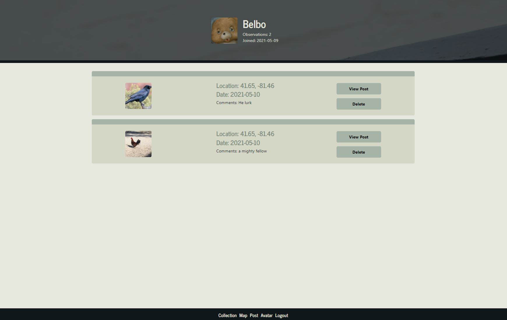
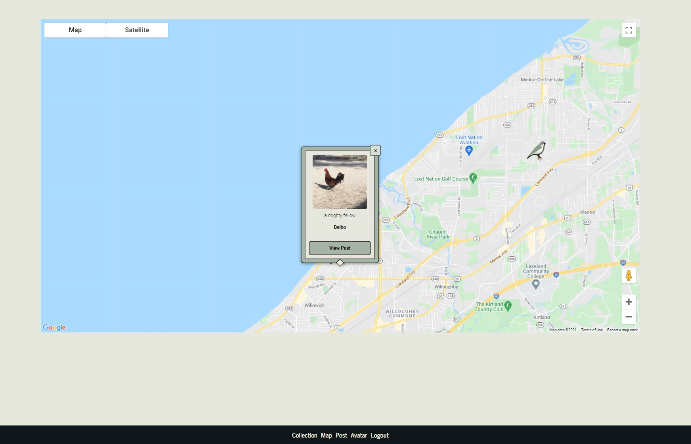

  
  # birdUp

  <h2>Description:</h2> a social image sharing site built in react with a mongo database. The application allows users to log in with google and make and update an account, make posts, and have pins set to a map for each post.

  <h2>Table of Contents:</h2> 

  [Installation](#install)

  [Usage](#usage)

  [License](#license)

  [Contributing](#contributing)

  [Tests](#tests)

  [Questions](#questions)

  <h3><a name="install">Installation:</a></h3>

  please run npm i to install all dependencies, you will need to be running a mongo database with the name birdUp and also insert the gitignored config file back into the config folder. please see aws s3 documentation for the JSON in the config file, or contact me. 

  <h3><a name="usage">Usage:</a></h3>

  please feel free to use as you see fit! here is the link to our deployed application: <a href="https://aqueous-dawn-98851.herokuapp.com/">birdUp on Heroku</a>

  <h3><a name="liscense">License:</a></h3>

  This work is covered under the CC0 1.0 Universal license.

  Full license information can be found here: [License: CC0-1.0](http://creativecommons.org/publicdomain/zero/1.0/)

  <h3><a name="contributing">Contributing:</a></h3> 

  feel free to fork us! 

  <a name="tests"><h3>Tests:</h3></a> 

  no test procedures exist at this time. 

  <a name="questions"><h3>Questions:</h3></a>  

  gitHub Name: forgetfulmind

  gitHub Link: <a href="https://github.com/forgetfulmind">https://github.com/forgetfulmind</a>

  eMail: forgetfulmind@gmail.com

  <a name="screenshots"><h3>Screenshots:</h3></a>  

